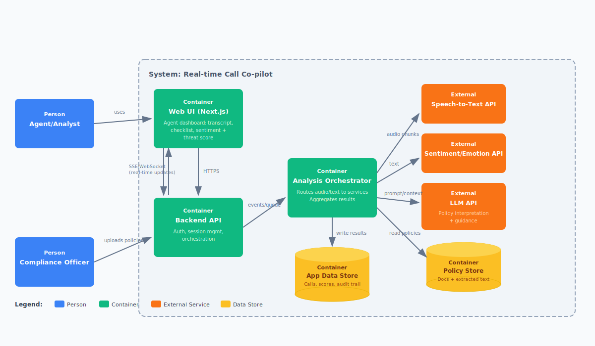

# First Pass Architecture

## Overview

The system is structured around a responsive Next.js frontend for agents and analysts, backed by an API and orchestration layer that manages live call sessions. As audio and text come in, they're routed to external services for transcription, sentiment analysis, and LLM-based interpretation. The results get pulled into a single stream and pushed back to the UI using server-sent events or WebSockets for real-time updates.

## Design Decisions

Policy data is stored separately from the call stream, allowing us to evolve ingestion and analysis independently. That separation helps keep the UI responsive while giving us room to iterate on backend logic without destabilizing the interface.

## Tradeoffs

The biggest tradeoff here is external API dependence. We're accepting a few seconds of end-to-end latency in exchange for faster delivery and lower implementation risk—appropriate for the Week 8 prototype, where speed of learning matters more than full control over each component.
