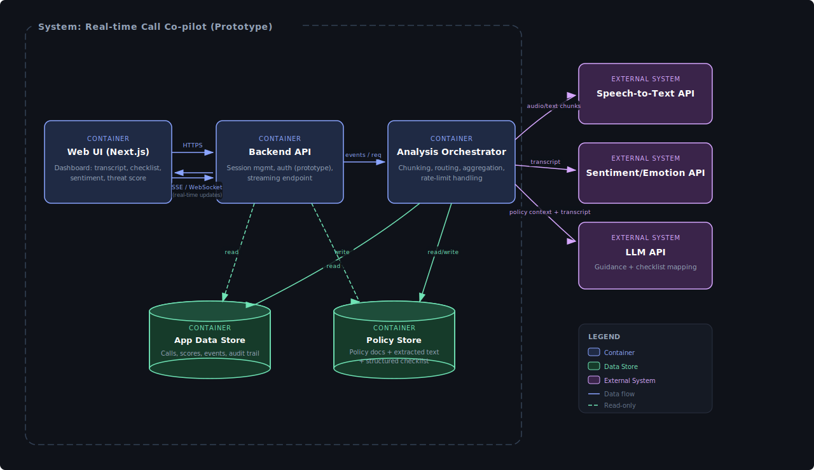

# Week 4 Architecture Review

## Design intent

This system supports a real-time “co-pilot” dashboard used during high-stakes calls. The primary goal of the prototype is to provide near-real-time feedback—live transcription, policy-driven compliance guidance, sentiment signals, and a composite “threat score”—while keeping the design simple enough for a small team to implement and defend.

At a container level, the system is deliberately decomposed into:

1. a Next.js Web UI optimized for responsiveness and rapid iteration,

2. a Backend API that owns session management and a streaming channel to the UI, and

3. an Analysis Orchestrator that routes data to external AI services and aggregates results into a coherent stream.

This structure separates concerns: the UI remains focused on presentation and interaction; the API maintains consistent session semantics and a stable interface; and the orchestrator concentrates the complexity of external service calls, throttling, aggregation, and fallbacks.

## What changed since Week 3 (and why)

The architecture is refined for Week 4’s “stress test” and trade-off defense. Specifically:

- People/actors were removed from the diagram: Week 4 evaluation emphasizes correct abstraction level, readable container boundaries, and defensible trade-offs. User roles are acknowledged here in text, but the diagram prioritizes system containers and dependencies.

- The Analysis Orchestrator is called out explicitly: In Week 3 first-pass designs, orchestration often gets blurred into “backend.” For stress testing, it is critical to identify which container bears responsibility for external API limits, batching/chunking, retries, and aggregation. Making it explicit clarifies where scaling pressure accumulates and what breaks first.

- Policy storage is separated from call/event storage: Policies and call events grow differently and change at different rates. Keeping them logically separate makes the system easier to evolve (e.g., policy versioning) without destabilizing call ingestion.

## Key trade-off accepted

_Trade-off: external AI dependencies and eventual consistency vs. build speed and clarity._

We accept that sentiment and policy interpretation come from third-party APIs that can introduce latency, rate limits, and occasional errors. In exchange, the team avoids building custom ML infrastructure and can deliver a functioning prototype within the course timeline. The architecture mitigates this by localizing external dependency handling in the orchestrator and designing the UI around incremental updates rather than blocking “perfect” results.

This is a conscious decision to optimize for a working, demonstrable system with clear evolution paths rather than an overbuilt architecture that would slow delivery.

## Major risks (with “what we’ll do now” vs. “what we’ll do later”)

1. External API rate limits / outages

- Risk: Orchestrator becomes unstable or slow when STT/LLM/Sentiment limits are hit.

- Now: Centralize retries/backoff and timeouts in orchestrator; degrade gracefully by marking partial results as “pending/unavailable.”

- Later: Add queue-based buffering, circuit breakers, and provider abstraction to swap services.

2. End-to-end latency (real-time perception)

- Risk: If updates arrive too slowly, the UI feels unreliable and users lose trust.

- Now: Use chunking (small units), stream partial transcript updates, and avoid blocking the UI on downstream analysis.

- Later: Parallelize analysis stages, introduce caching for repeated policy prompts, and pre-compute policy embeddings.

3. Data growth and storage costs

- Risk: Transcripts and event logs grow quickly; naive storage patterns become slow and expensive.

- Now: Store compact “events” plus periodic summaries; keep raw transcript segments bounded by session.

- Later: Implement retention policies, cold storage, and analytics partitions.

4. Policy interpretation quality

- Risk: Incorrect checklist mapping produces misleading “compliance” guidance.

- Now: Make policy-driven outputs explicitly “assistive,” include confidence indicators, and allow human override.

- Later: Add policy versioning, evaluation harness (golden tests), and monitoring for false positives/negatives.

## Explicit trade-offs we are making

- Monolith-ish prototype vs. microservices: keep containers conceptually separated but do not prematurely split deployables; optimize for a small team and short schedule.

- Streaming UX vs. “final perfect answer”: show partial updates quickly; accept some eventual consistency.

- External managed intelligence vs. in-house models: accept dependency risk to reduce build complexity and deliver on time.
