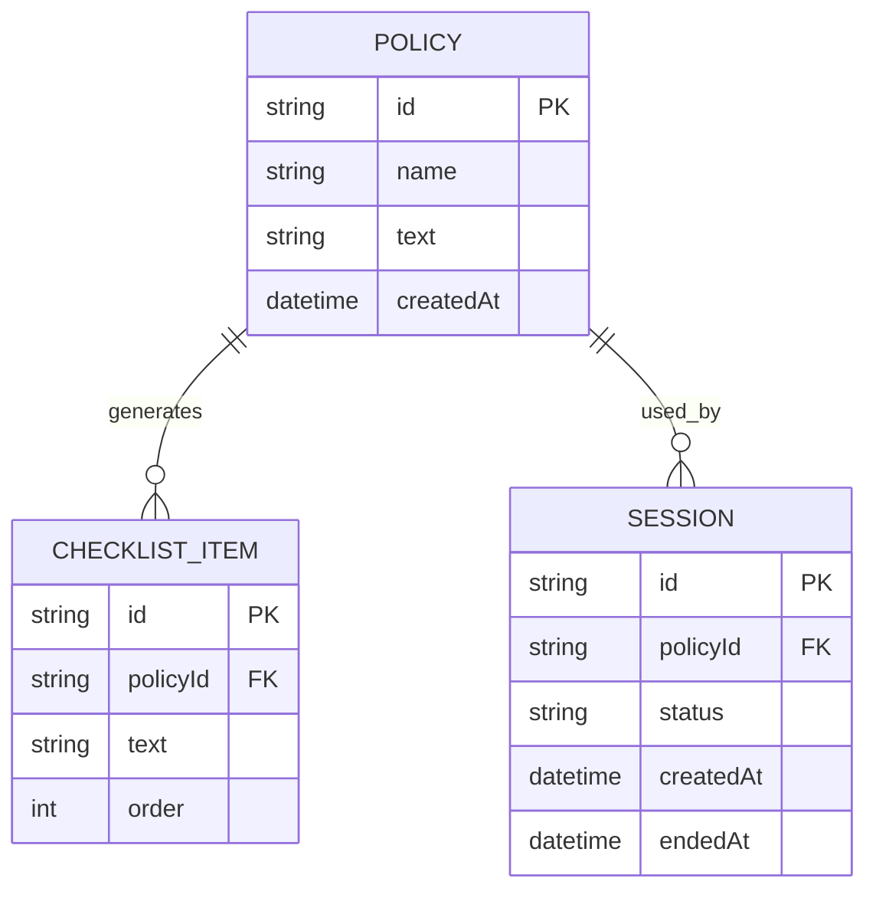

# Minimum Data Model (Week 6 MVP) — Story #1 Policy Upload → Checklist

This model supports Story #1:
Admin uploads a policy text file and the system generates a checklist.

Storage may be in-memory for MVP, but the repository boundary should isolate persistence concerns.

---

## Entities

## Policy

- id (string, PK)
- name (string)
- text (string) — raw policy text
- createdAt (timestamp)

## ChecklistItem

- id (string, PK)
- policyId (FK → Policy.id)
- text (string)
- order (int)

## Session (optional but recommended)

- id (string, PK)
- policyId (FK → Policy.id)
- status ("active" | "ended")
- createdAt (timestamp)
- endedAt (timestamp, nullable)

---

## Relationships

- Policy 1 → many ChecklistItem
- Policy 1 → many Session

---

## ERD (Mermaid)

