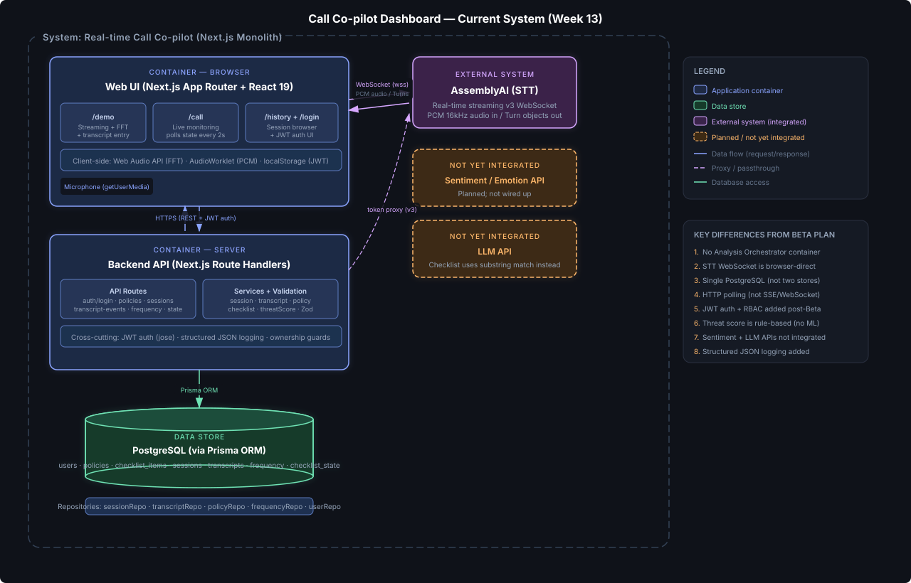

# Week 13 — Architecture Snapshot Update

## Updated Diagram



The new diagram (`docs/architecture/current-system-diagram.svg`) reflects the actual implemented system as of Week 13. The previous diagrams (`architecture-first-pass.svg`, `container-diagram.svg`) are preserved in the same directory to show design evolution.

---

## Current Architecture Summary

The Call Co-pilot Dashboard is a **Next.js monolith** (App Router) that serves both the frontend UI and the backend API from a single deployable. There is no separate backend server or analysis orchestrator — all business logic runs inside Next.js route handlers backed by a service layer and Prisma-based repository layer.

### High-level data flow

```
Browser (React 19 client components)
  ├── /demo: captures mic audio → streams PCM to AssemblyAI WebSocket (direct)
  │         → receives Turn transcripts → POSTs to /api/sessions/[id]/transcript-events
  │         → captures FFT bins (Web Audio API) → POSTs to /api/sessions/[id]/frequency
  ├── /call: polls /api/sessions/[id]/state every 2 seconds
  ├── /history: fetches ended sessions + detail views
  └── /login: authenticates via /api/auth/login → stores JWT in localStorage + cookie

Next.js Backend (route handlers)
  ├── Auth: JWT (HS256 via jose) · role-based access (agent/supervisor)
  ├── Services: session · transcript · policy · checklist · threatScore
  ├── Validation: Zod schemas (transcript, session, policy, frequency)
  └── Logging: structured JSON to stdout/stderr

PostgreSQL (via Prisma ORM)
  └── users · policies · checklist_items · sessions · transcript_entries
      · frequency_snapshots · checklist_states
```

---

## Key System Components and Responsibilities

### Frontend (Browser)

| Component | File | Responsibility |
|-----------|------|----------------|
| **Demo page** | `app/demo/page.tsx` | Full-featured workbench: policy CRUD, session management, real-time AssemblyAI WebSocket streaming, FFT frequency capture (Web Audio API), transcript buffering, and checklist display |
| **Call page** | `app/call/page.tsx` | Simplified monitoring UI: policy selector, session creation, polls `/state` endpoint every 2s, displays transcript + checklist + threat score |
| **History page** | `app/history/page.tsx` | Browse ended sessions with expandable detail (transcript, checklist, threat score) |
| **Login page** | `app/login/page.tsx` | Email/password form, stores JWT in both localStorage and HttpOnly cookie |
| **NavBar** | `app/components/NavBar.tsx` | Navigation links, auth-aware (login/logout), hidden on `/login` route |

### Backend API (Next.js Route Handlers)

| Endpoint | Responsibility |
|----------|----------------|
| `POST /api/auth/login` | Validates credentials (SHA256 hash), signs JWT (HS256, 8h expiry), sets HttpOnly cookie |
| `POST/GET /api/policies` | Create policy from text (splits newlines into checklist items), list all policies |
| `GET /api/policies/[id]` | Fetch single policy with ordered checklist |
| `POST/GET /api/sessions` | Create session (owned by authenticated user), list sessions (agent sees own, supervisor sees all) |
| `GET /api/sessions/[id]/state` | Aggregated state: session metadata + transcript + checklist + frequency snapshots + threat score (computed on-the-fly) |
| `POST /api/sessions/[id]/end` | End session (idempotent) |
| `POST /api/sessions/[id]/transcript-events` | Ingest transcript events, auto-check matching checklist items, enforce transcript windowing (50k char limit) |
| `POST/GET /api/sessions/[id]/frequency` | Store/retrieve frequency snapshots (FFT bins) |
| `POST /api/assemblyai/token` | Proxy request to AssemblyAI v3 token endpoint, returns temporary 60s streaming token |

### Services Layer

| Service | File | Responsibility |
|---------|------|----------------|
| **sessionService** | `lib/services/sessionService.ts` | Create session (validates policy exists), list filtered by role, end session |
| **transcriptService** | `lib/services/transcriptService.ts` | Append transcript events, prune if over 50k char window (keeps newest), get full transcript |
| **policyService** | `lib/services/policyService.ts` | Create policy from text (split lines into checklist), fetch, list |
| **checklistService** | `lib/services/checklistService.ts` | Auto-check checklist items via normalized case-insensitive substring match |
| **threatScoreService** | `lib/services/threatScoreService.ts` | Compute composite threat score from frequency stress (35%), compliance gap (35%), keyword threat (30%) |

### Data Layer

| Repository | File | What it accesses |
|------------|------|------------------|
| **sessionRepo** | `lib/repositories/sessionRepo.ts` | `Session` table — save, get, list, update status |
| **transcriptRepo** | `lib/repositories/transcriptRepo.ts` | `TranscriptEntry` table — append, get, prune by count |
| **policyRepo** | `lib/repositories/policyRepo.ts` | `Policy` + `ChecklistItem` tables — save, get, list |
| **frequencyRepo** | `lib/repositories/frequencyRepo.ts` | `FrequencySnapshot` table — append, get by session |
| **checklistStateRepo** | `lib/repositories/checklistStateRepo.ts` | `ChecklistState` table — mark checked, get checked IDs |
| **userRepo** | `lib/repositories/userRepo.ts` | `User` table — save, get by ID or email |

### Cross-Cutting Concerns

| Concern | File | Implementation |
|---------|------|----------------|
| **Authentication** | `lib/auth.ts` | JWT (HS256 via `jose`), dual delivery (cookie + header), role extraction |
| **Authorization** | `lib/auth.ts` | `assertOwnership()` — agents can only access their own sessions; supervisors bypass |
| **Validation** | `lib/validation/schemas.ts` | Zod schemas for all POST body payloads |
| **Logging** | `lib/logger.ts` | Structured JSON to stdout/stderr (`{ timestamp, level, event, sessionId?, data? }`) |
| **Database** | `lib/db.ts` | Prisma singleton with `globalThis` caching for dev-mode HMR stability |

### External Integrations

| System | Integration Point | Status |
|--------|--------------------|--------|
| **AssemblyAI** (Speech-to-Text) | Browser → WebSocket (wss://streaming.assemblyai.com/v3/ws); Backend proxies token only | **Integrated** |
| **Sentiment/Emotion API** | — | **Not integrated** (planned) |
| **LLM API** | — | **Not integrated** — checklist uses substring matching instead |

---

## What Changed Since Beta / Earlier Design Reviews

The Week 4 architecture review (`docs/architecture/week4-architecture-review.md`) and its container diagram depicted an aspirational design. Here is what actually changed:

### 1. Analysis Orchestrator was never built

**Old design:** A separate "Analysis Orchestrator" container was planned to handle chunking, routing to external APIs, rate-limit handling, and result aggregation.

**What happened:** Threat scoring, checklist matching, and transcript processing were implemented as stateless service functions called directly from API route handlers. There was no need for a separate orchestrator because only one external API (AssemblyAI) was integrated, and the analysis logic (keyword matching, frequency thresholds, compliance gaps) is entirely rule-based.

### 2. STT moved from server-side to browser-direct

**Old design:** Audio was expected to flow from the browser → Backend API → Orchestrator → STT API.

**What happened:** The browser connects directly to AssemblyAI's WebSocket endpoint. The backend only proxies the token request (POST `/api/assemblyai/token`). This avoids double-hop latency and reduces server load, but means the backend never sees raw audio.

### 3. Two data stores collapsed into one PostgreSQL database

**Old design:** Separate "App Data Store" (calls, scores, events) and "Policy Store" (documents, checklists).

**What happened:** All data lives in a single PostgreSQL database managed by Prisma. Policies and sessions share the same database, linked by foreign keys. The logical separation still exists at the repository layer, but the physical storage is unified.

### 4. SSE/WebSocket from backend was replaced by HTTP polling

**Old design:** Backend API would push real-time updates to the UI via SSE or WebSocket.

**What happened:** The `/call` page polls `GET /api/sessions/[id]/state` every 2 seconds. The `/demo` page posts data to the backend and reads state via HTTP. There is no server-push channel from the backend to the browser.

### 5. Auth + RBAC was added (not in original design)

**Not in old design.** JWT-based authentication with role-based access control (agent/supervisor) was added during the Beta phase. Every protected API route verifies the JWT and enforces ownership constraints.

### 6. History page was added (not in original design)

**Not in old design.** A `/history` page allows browsing ended sessions with full detail (transcript, checklist, threat score). This required the `GET /api/sessions?status=ended` endpoint and session-summary queries with policy name joins.

### 7. Frequency analysis / acoustic signal processing was added

**Not in old design.** The `/demo` page captures real-time FFT data from the browser's Web Audio API and POSTs frequency snapshots to the backend. These feed into the threat score's "frequency stress" component (elevated vocal pitch in the 250–400 Hz range).

### 8. Structured logging was added

**Not in old design.** All API routes and services emit structured JSON logs via `lib/logger.ts`. Each log entry includes timestamp, level, event name, optional session ID, and contextual data.

### 9. Sentiment and LLM APIs remain unintegrated

**Old design:** Orchestrator would route transcript data to Sentiment/Emotion and LLM APIs.

**What happened:** These were never integrated. Checklist auto-checking uses case-insensitive substring matching. Threat scoring uses hardcoded keyword lists. The architecture accommodates adding these later, but they are not present in the current system.

---

## Remaining Architectural Risks and Constraints

### Active Risks

1. **No server-push channel** — The `/call` page polls every 2 seconds. Under heavy load or with many concurrent sessions, this creates unnecessary request volume. A future WebSocket or SSE channel from the backend would reduce latency and server load.

2. **Threat scoring is purely rule-based** — The keyword list is hardcoded (15 words), frequency stress thresholds are fixed, and checklist matching is substring-based. This works for the prototype but would produce false positives/negatives in production. Adding an LLM or embedding-based approach would improve accuracy.

3. **Password hashing uses SHA256 without salt** — Not bcrypt or Argon2. Acceptable for a prototype with seed users, but a security concern if deployed with real credentials.

4. **JWT secret has an insecure dev default** — `lib/auth.ts` falls back to `"dev-secret-change-me-in-production"` when `JWT_SECRET` is not set. Production deployment must enforce this env var.

5. **No rate limiting, CORS, or CSRF protection** — API endpoints are open to abuse. The `assemblyai/token` endpoint is unauthenticated, which could be exploited to drain API credits.

6. **High-frequency data ingestion without aggregation** — Frequency snapshots are captured every 250ms (14,400 per hour per session). No downsampling or aggregation is performed before storage. This will cause table bloat in long or numerous sessions.

### Constraints

7. **Single-tenant prototype** — No multi-tenancy, no SaaS isolation, no tenant-scoped data. The supervisor role sees all sessions globally.

8. **Free-tier API limits** — AssemblyAI streaming is limited by account plan. Graceful degradation is handled by the frontend (shows error state), but there is no retry or fallback STT provider.

9. **No CI/CD deployment pipeline** — The system runs via `npm run dev` or `npm run build && npm run start`. There is no containerization, no staging environment, and no automated deployment.

10. **Monolithic frontend components** — `demo/page.tsx` (717 lines) and `call/page.tsx` (392 lines) are large single-file components mixing multiple concerns (audio, state, UI). This makes them hard to test and modify independently.

---

## Files Created/Modified

| File | Status |
|------|--------|
| `docs/architecture/current-system-diagram.svg` | **Created** — updated container diagram reflecting actual system |
| `docs/final/week13-architecture.md` | **Created** — this document (Deliverable E) |

Previous architecture artifacts are preserved unchanged:
- `docs/architecture/architecture-first-pass.svg` — Week 3 first-pass diagram
- `docs/architecture/first-pass-architecture.md` — Week 3 overview
- `docs/architecture/container-diagram.svg` — Week 4 container diagram
- `docs/architecture/week4-architecture-review.md` — Week 4 review + trade-offs
